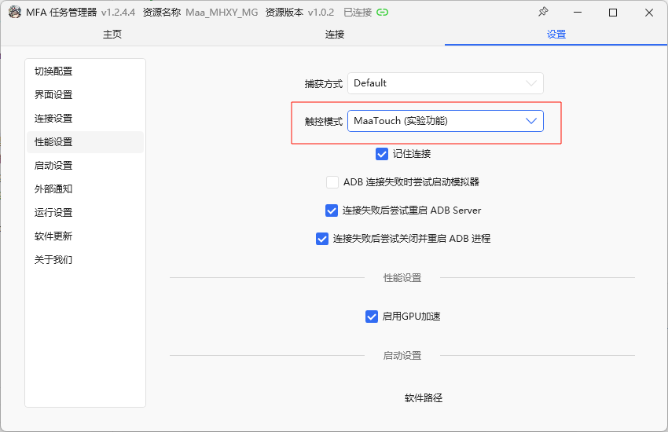
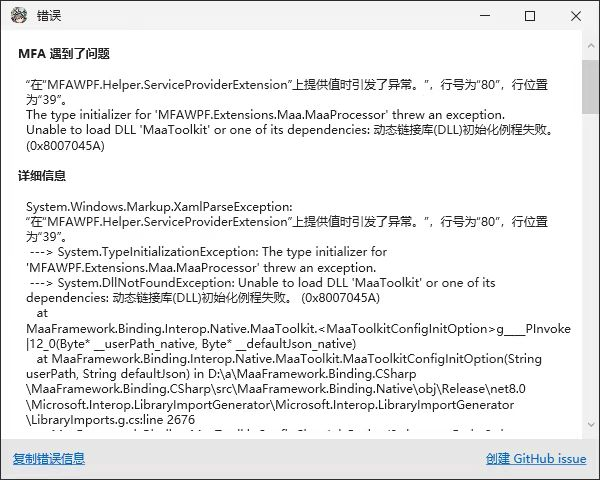
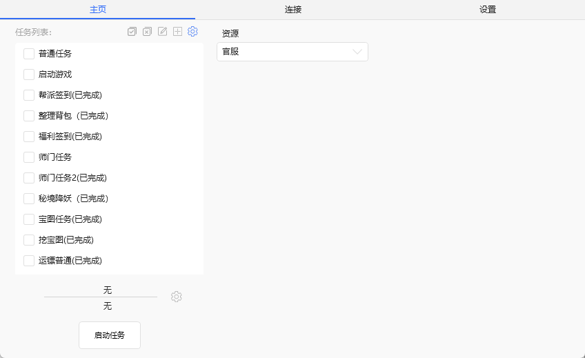
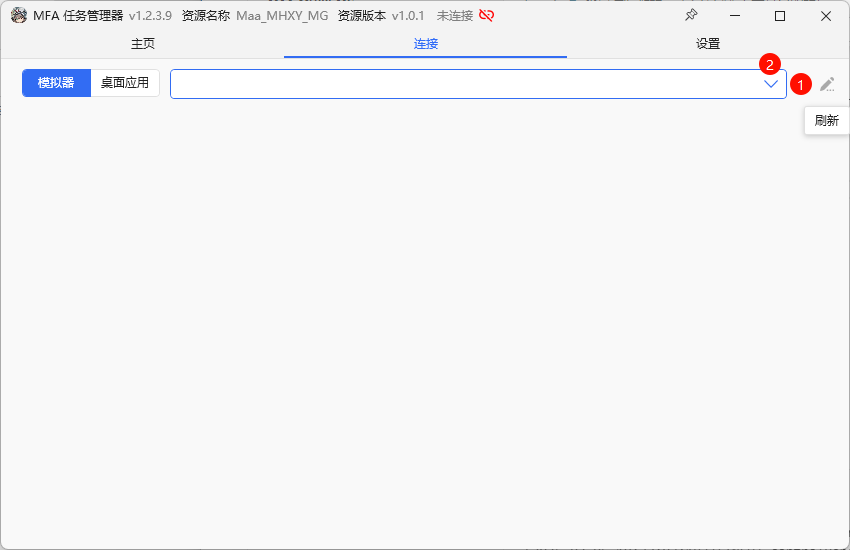
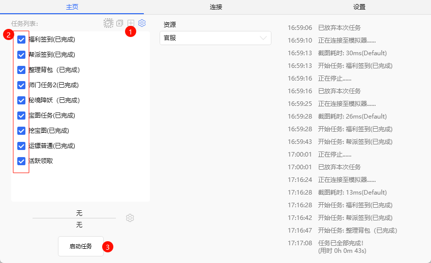
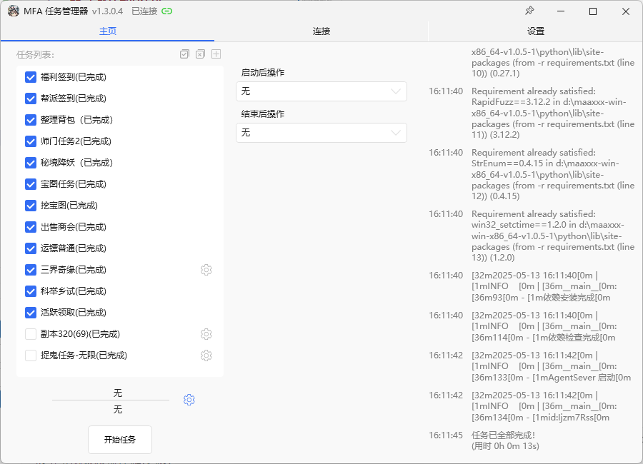

## 下载打包的程序

1.下载对应系统（Android、win、macos）版本的X86，arm\
2.解压后运行 `MFAWPF.exe` 即可\
3.MUMU模拟器12，1280*720 240dpi\
4.安装python环境，并复制python文件到项目根目录下/python\

### 设置更改
调整触控模式为maatouch

### 1.报错

一般是电脑缺少某些运行库，请安装一下 vc_redist

### 测试
建议第一次使用本程序运行前，首先单独运行 “福利签到” 测试，如无法运行请试运行[cmd教程](./CMD运行教程.md)
### 启动MFAWPF
MFAWPF主界面

### 刷新并选择模拟器

### 1.选择任务，2.选择要启动的任务，3.启动。4.右键删除

### 演示示例

